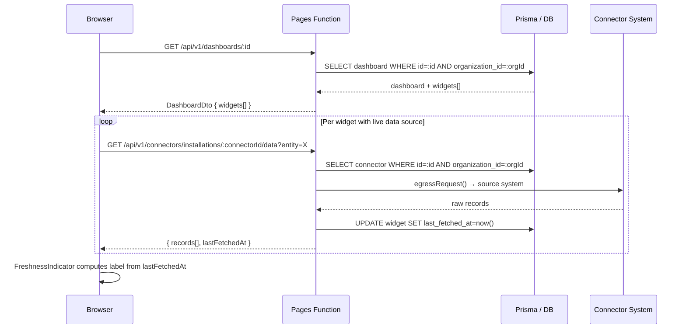
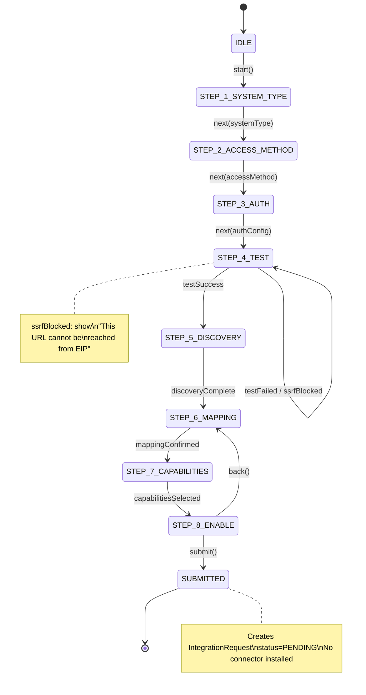
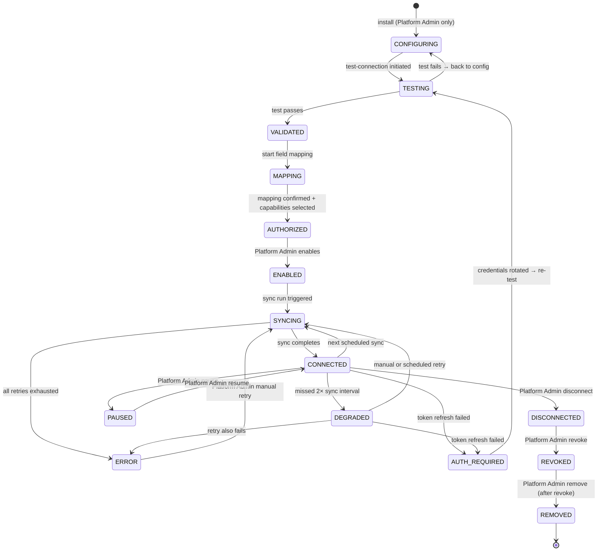

# Design Document

## Feature: Client Dashboard + Connector Platform

**Spec:** `client-dashboard-connector-platform`  
**Workflow:** Requirements-First  
**Status:** Design

---

## Overview

This feature delivers three tightly coupled domains on top of the existing Ellines EIP platform:

1. **Customer Dashboard Engine** — persistent, customizable, role-adaptive dashboards for client organization users, powered by real database queries and connected systems.
2. **Professional Glass UI Visual System** — a CSS token system governing all customer-facing surfaces, built on Exo 2, the Ellines brand palette, and WCAG 2.1 AA.
3. **Universal Connector Client Experience** — an 8-step wizard, a hardened egress layer, field mapping, OpenAPI import, lifecycle management, and the full client-facing connector management surface.

The three domains are deliberately inseparable: connectors feed widget availability; dashboards are governed by the visual system; navigation is exclusively managed through `app-navigation.ts`.

**What this design does NOT change:**
- The Super Admin Control Plane at `/app/platform` (page, layout, navigation)
- The existing connector install API in `functions/api/v1/connectors/installations.ts`
- The `encrypt()` / `decrypt()` contract in `packages/shared/src/encryption.ts` (to be created — currently in the shared index)
- The `OPERATION_REGISTRY` in `packages/shared/src/safeguards.ts`
- The existing `NAV_ITEMS`, `SUPER_ADMIN_NAV`, and `WORKSPACE_NAV_ORDER` exports from `app-navigation.ts`

---

## Architecture

### System Component Diagram

```mermaid
graph TB
  subgraph Browser["Browser (Client Org User)"]
    ClientSidebar["ClientSidebar\n(app-navigation.ts CLIENT_NAV_GROUPS)"]
    DashboardHeader["DashboardHeader\n(org switcher · notifications · search)"]
    DashboardPage["Dashboard Page\n(/app/dashboards/[id])"]
    WidgetCanvas["Widget Canvas\n(Widget[] + FreshnessIndicator)"]
    AttentionCenter["AttentionCenter\n(aggregated attention items)"]
    ConnectorWizard["ConnectorWizard\n(8-step state machine)"]
  end

  subgraph PagesFunc["Cloudflare Pages Functions"]
    DashAPI["/api/v1/dashboards/*"]
    ConnAPI["/api/v1/connectors/*\n(existing, extended)"]
    IntReqAPI["/api/v1/connectors/integration-requests"]
    TestConnAPI["/api/v1/connectors/test-connection"]
    AttentionAPI["/api/v1/dashboards/attention"]
  end

  subgraph SharedPkg["packages/shared"]
    EncryptMod["encryption.ts\n(encrypt / decrypt)"]
    EgressMod["egress.ts ← NEW\n(egressRequest · validateEgressUrl · SSRF_Guard)"]
    FieldMapper["field-mapper.ts ← NEW\n(applyFieldMap · validateFieldMap)"]
    OpenApiImporter["openapi-importer.ts ← NEW\n(parse only, no network)"]
    WidgetRegistry["widget-registry.ts ← NEW\n(WIDGET_REGISTRY: 24 types)"]
    UEM["uem.ts (existing)"]
    Safeguards["safeguards.ts (existing)"]
  end

  subgraph IdentityDB["PostgreSQL (via Prisma)"]
    Dashboards["dashboards"]
    DashWidgets["dashboard_widgets"]
    ConnInstalls["connector_installations\n(existing, extended)"]
    ConnSyncRuns["connector_sync_runs\n(existing)"]
    ConnFailedRec["connector_failed_records ← NEW"]
    IntegrationReqs["integration_requests ← NEW"]
    AuditRows["audit_rows (existing)"]
  end

  ClientSidebar --> DashAPI
  DashboardHeader --> AttentionAPI
  WidgetCanvas --> DashAPI
  ConnectorWizard --> TestConnAPI
  ConnectorWizard --> IntReqAPI

  DashAPI --> EncryptMod
  DashAPI --> Dashboards
  DashAPI --> DashWidgets
  DashAPI --> AuditRows
  AttentionAPI --> ConnInstalls
  TestConnAPI --> EgressMod
  ConnAPI --> EgressMod
  ConnAPI --> FieldMapper
  ConnAPI --> ConnInstalls
  ConnAPI --> ConnSyncRuns
  ConnAPI --> ConnFailedRec
  ConnAPI --> AuditRows
  IntReqAPI --> IntegrationReqs
  EgressMod --> EncryptMod

  DashboardPage --> WidgetCanvas
  DashboardPage --> AttentionCenter
  AttentionCenter --> AttentionAPI

  FieldMapper --> UEM
  ConnAPI --> OpenApiImporter
  WidgetCanvas --> WidgetRegistry
```



### Request Flow: Dashboard Widget Render



---

## Components and Interfaces

### 1. `app-navigation.ts` additions

**New types (additive — no existing type changes):**

```typescript
/** Client-org user sidebar groups — distinct from NavGroupId (Super Admin). */
export type ClientNavGroupId =
  | 'client-home'
  | 'client-business'
  | 'client-operations'
  | 'client-people'
  | 'client-crm'
  | 'client-integrations'
  | 'client-automation'
  | 'client-intelligence'
  | 'client-administration';

export interface ClientNavItem {
  id: string;
  label: string;
  href: string;
  icon: NavIconId | ClientNavIconId;
  group: ClientNavGroupId;
  available: boolean;
  note?: string;
  /** Minimum role level required. Absent = all roles. */
  minRole?: 'owner' | 'manager' | 'member';
  /** Feature flag / package feature key required. Absent = always shown. */
  requiresPackageFeature?: string;
}

export type ClientNavIconId =
  | 'dashboard'
  | 'my-work'
  | 'attention'
  | 'business-overview'
  | 'performance'
  | 'analytics'
  | 'sales'
  | 'purchases'
  | 'inventory'
  | 'customers'
  | 'suppliers'
  | 'payments'
  | 'expenses'
  | 'assets'
  | 'branches'
  | 'warehouses'
  | 'employees'
  | 'departments'
  | 'attendance'
  | 'leave'
  | 'payroll'
  | 'leads'
  | 'opportunities'
  | 'activities'
  | 'follow-ups'
  | 'connected-systems'
  | 'connector-health'
  | 'integration-requests'
  | 'schedules'
  | 'executions'
  | 'insights'
  | 'recommendations'
  | 'business-settings'
  | 'data-privacy';

export interface ClientNavGroupDef {
  id: ClientNavGroupId;
  label: string;
  collapsible: boolean;
  defaultOpen: boolean;
  itemIds: string[];
}

/** Resolve client sidebar items given role + package features + explicit grants. */
export function resolveClientNavigation(opts: {
  role: 'owner' | 'executive' | 'manager' | 'member' | 'viewer';
  packageFeatures: string[];
  grantedPermissions: string[];
}): ClientNavGroupDef[];
```

**`CLIENT_NAV_ITEMS`** — array of `ClientNavItem` covering all 9 groups from Requirement 8. Items with `available: false` still appear (rendered as planned state). Items are never omitted — only filtered by role/package at render time.

**`CLIENT_NAV_GROUPS`** — array of `ClientNavGroupDef` defining the 9 group structure. Exported constant, rendered by `ClientSidebar`.

---

### 2. ClientSidebar component

**File:** `apps/web/src/components/client-sidebar/ClientSidebar.tsx`

```typescript
interface ClientSidebarProps {
  role: 'owner' | 'executive' | 'manager' | 'member' | 'viewer';
  packageFeatures: string[];
  grantedPermissions: string[];
  orgName: string;
  collapsed: boolean;
  onToggleCollapse: () => void;
}
```

- Reads from `CLIENT_NAV_GROUPS` + `CLIENT_NAV_ITEMS` — never defines its own navigation.
- Calls `resolveClientNavigation()` to filter by role + package.
- Renders `<nav aria-label="Business navigation">` → `<ul>` → `<li>` → `<a>` (live) or `<span aria-disabled>` (planned).
- Group collapsing via `<button aria-expanded>` toggle. CSS transition on height (suppressed under `prefers-reduced-motion`).
- Keyboard: `Tab` traverses items; `Enter`/`Space` activates; `ArrowUp`/`ArrowDown` navigate within group.
- Responsive: CSS classes `[data-collapsed]` and media queries — no JS resize observer needed.
- Does NOT render any `PlatformSectionId` items. This constraint is enforced in `resolveClientNavigation()`.

---

### 3. DashboardHeader component

**File:** `apps/web/src/components/dashboard-header/DashboardHeader.tsx`

```typescript
interface DashboardHeaderProps {
  orgName: string;
  orgRole: string;
  orgMemberships: Array<{ id: string; name: string; role: string }>;
  refreshingCount: number;
  onOrgSwitch: (orgId: string) => void;
}
```

- Mounted in `/app` layout (excluding `/app/platform`). Does not unmount between route transitions.
- Business selector: `<select>` or custom dropdown, visible when `orgMemberships.length > 1`.
- Notification badge: polls `GET /api/v1/dashboards/attention` every 60 s. Displays count of unresolved critical+high items. `aria-live="polite"` on the badge element.
- Refreshing indicator: `aria-live="assertive"`. Clears within 2 s of all fetches completing. Auto-clears after 30 s regardless (Requirement 10.6).
- All interactive elements (`Tab`-reachable, `Enter`/`Space` activatable).
- Ellinea button: opens Ellinea chat panel (existing `EllineaChatPanel` component).

---

### 4. FreshnessIndicator component

**File:** `apps/web/src/components/freshness-indicator/FreshnessIndicator.tsx`

```typescript
interface FreshnessIndicatorProps {
  lastFetchedAt: Date | null;
  errorState: string | null;
  /** Overrides computed label — for SNAPSHOT or HISTORICAL types. */
  labelOverride?: 'Snapshot' | 'Historical';
}

/** Pure label computation — no side effects, no randomness. */
export function computeFreshnessLabel(
  lastFetchedAt: Date | null,
  errorState: string | null,
  now: Date,
  labelOverride?: string,
): FreshnessLabel;

export type FreshnessLabel =
  | 'LIVE'               // age ≤ 5 s
  | `Updated ${number} seconds ago`  // 5–59 s
  | `Updated ${number} minutes ago`  // 1–59 min
  | `Cached — ${number} minutes old` // ≥ 60 min
  | 'Snapshot'
  | 'Historical'
  | 'Unavailable';
```

- `computeFreshnessLabel` is a pure function — exported and testable independently.
- Component uses `useEffect` + `setInterval` to re-evaluate label every 5 s. Cleared on unmount.
- Renders `<span aria-label={label} className={styles[labelVariant]}>`.
- When `errorState != null`, always renders `Unavailable` regardless of `lastFetchedAt`.
- When `labelOverride` is set, ignores age computation entirely.

---

### 5. Widget component

**File:** `apps/web/src/components/widget/Widget.tsx`

```typescript
interface WidgetProps {
  widgetTypeId: string;
  config: Record<string, unknown>;
  dataSourceRef: string | null;
  lastFetchedAt: Date | null;
  errorState: string | null;
  refreshOverrideSeconds: number | null;
  position: { col: number; row: number; width: number; height: number };
  onRemove?: () => void;
  onConfigChange?: (config: Record<string, unknown>) => void;
}
```

- Looks up `WIDGET_REGISTRY[widgetTypeId]` — if unknown type, renders an error placeholder.
- Schedules its own data fetch using `refreshOverrideSeconds ?? dashboardRefreshPolicy`.
- Clears `setInterval` on unmount (Requirement 5.5).
- When connector source enters DISABLED/ERROR: renders `errorState` with staleness label (Requirement 4.6).
- Drill-down capable types (KPI, Table, FinancialSummary, InventorySummary, AlertList): render a clickable affordance that navigates to detail view. Drill-down depth capped at 3 (Requirement 4.7).
- Charts provide `<table aria-hidden="false" className={styles.srOnly}>` as accessible alternative (Requirement 11.2).

---

### 6. AttentionCenter component

**File:** `apps/web/src/components/attention-center/AttentionCenter.tsx`

- Calls `GET /api/v1/dashboards/attention` on mount and on a 60-second poll.
- Renders attention items grouped by severity. Badge count fed to `DashboardHeader` via React context or prop.
- Dismiss action: `DELETE /api/v1/dashboards/attention/:itemId`. Optimistically removes item; restores on error.
- Recurrence flag surfaced as a `[Recurrence]` badge on returned items.

---

### 7. ConnectorWizard component

**File:** `apps/web/src/components/connector-wizard/ConnectorWizard.tsx`

State machine driven — see State Machines section below. Wizard state persisted to `sessionStorage` (key: `eip_wizard_${orgId}`). Credentials masked via `type="password"`. No credential values written to `localStorage` or console.

---

## Data Models

### New Prisma Models

Add to `services/identity/prisma/schema.prisma`:

```prisma
// ─────────────────────────────────────────────
// Dashboard Engine
// ─────────────────────────────────────────────

model Dashboard {
  id             String              @id @default(cuid())
  organizationId String
  ownerUserId    String
  name           String              @db.VarChar(120)
  description    String              @default("") @db.VarChar(500)
  type           DashboardType
  visibility     DashboardVisibility @default(PRIVATE)
  isDefault      Boolean             @default(false)
  layoutConfig   Json                @default("{}")
  refreshPolicy  Int                 @default(300) // 30–86400 seconds
  createdAt      DateTime            @default(now())
  updatedAt      DateTime            @updatedAt
  widgets        DashboardWidget[]
  organization   Organization        @relation(fields: [organizationId], references: [id], onDelete: Cascade)

  @@index([organizationId, ownerUserId])
  @@index([organizationId, isDefault])
}

model DashboardWidget {
  id                     String    @id @default(cuid())
  dashboardId            String
  widgetTypeId           String    @db.VarChar(64)
  col                    Int       @default(0)
  row                    Int       @default(0)
  width                  Int       @default(4)
  height                 Int       @default(3)
  config                 Json      @default("{}")
  dataSourceRef          String?
  refreshOverrideSeconds Int?
  lastFetchedAt          DateTime?
  errorState             String?
  createdAt              DateTime  @default(now())
  dashboard              Dashboard @relation(fields: [dashboardId], references: [id], onDelete: Cascade)

  @@index([dashboardId])
}

model ConnectorFailedRecord {
  id             String   @id @default(cuid())
  connectorId    String
  organizationId String
  sourceRecordId String
  failureReason  String
  rawPayloadHash String
  createdAt      DateTime @default(now())

  @@index([connectorId, organizationId])
}

model IntegrationRequest {
  id                   String   @id @default(cuid())
  requesterUserId      String
  organizationId       String
  requestedSystemName  String
  requestedConnectorType String
  businessJustification String   @default("")
  status               IntegrationRequestStatus @default(PENDING)
  reviewedByUserId     String?
  reviewedAt           DateTime?
  reviewNote           String?
  requestedAt          DateTime @default(now())
  updatedAt            DateTime @updatedAt

  @@index([organizationId, status])
}

enum DashboardType {
  EXECUTIVE
  OPERATIONS
  FINANCE
  HR
  SALES
  INVENTORY
  CRM
  CUSTOM
  STAFF_MY_WORK
}

enum DashboardVisibility {
  PRIVATE
  SHARED
  PUBLISHED
}

enum IntegrationRequestStatus {
  PENDING
  APPROVED
  REJECTED
  CANCELLED
}
```

### Existing Model Extensions

`connector_installations` — add columns via `db:push`:

| Column | Type | Purpose |
|---|---|---|
| `lifecycle_state` | `VARCHAR(40)` | Tracks state machine position (CONFIGURING, TESTING, …) |
| `discovery_snapshot` | `JSONB` | Last discovery result from Req 18 |
| `schema_drift_detected` | `BOOLEAN DEFAULT false` | Set on schema change detection |
| `mapping_version` | `INT DEFAULT 1` | Incremented on each field map change |
| `fallback_chain` | `JSONB DEFAULT '[]'` | Ordered list of fallback connector configs |
| `sync_interval_seconds` | `INT DEFAULT 3600` | Configured sync interval |
| `last_sync_at` | `TIMESTAMPTZ` | Last successful sync timestamp |

---

## API Design

All new Pages Functions follow the existing pattern in `apps/web/functions/api/v1/`. Auth via `requireAuth()`. Org scope via `auth.organizationId`. Every mutation writes an audit row.

### Dashboard API

#### `GET /api/v1/dashboards`
- Auth: any org user
- Filter: `organization_id = auth.organizationId`
- Returns: `DashboardSummaryDto[]` (no `layoutConfig` or `widgets`)
- Optional: `?type=EXECUTIVE&default=true`

#### `POST /api/v1/dashboards`
- Auth: requires `dashboard:create` permission
- Body: `{ name, description, type, visibility, refreshPolicy, layoutConfig? }`
- Validates: name 1–120 chars, description 0–500, refreshPolicy 30–86400, valid DashboardType enum
- Enforces: org total dashboard count < 500 (422 if at limit)
- Returns: `DashboardDto` (201)

#### `GET /api/v1/dashboards/[id]`
- Auth: any org user
- Validates: `dashboard.organizationId === auth.organizationId` (403 if mismatch)
- Returns: `DashboardDto` including `widgets[]`

#### `PATCH /api/v1/dashboards/[id]`
- Auth: requires `dashboard:write` permission; `ownerUserId === auth.sub` OR isOrgAdmin
- Body: partial `{ name?, description?, visibility?, refreshPolicy?, layoutConfig? }`
- Writes audit row if `visibility` changes (within same transaction)

#### `DELETE /api/v1/dashboards/[id]`
- Auth: requires `dashboard:delete`
- If `isDefault=true`: clears flag and includes `{ defaultCleared: true }` in response body
- Cascades to `DashboardWidget` (database ON DELETE CASCADE)

#### `POST /api/v1/dashboards/[id]/duplicate`
- Auth: requires `dashboard:create`
- Creates new dashboard with same type/config; name = `"{original} (Copy)"`; `isDefault=false`; `visibility=PRIVATE`

#### `POST /api/v1/dashboards/[id]/default`
- Auth: ownerUserId === auth.sub OR isOrgAdmin
- Transaction (SERIALIZABLE): set all `isDefault=false` WHERE `ownerUserId=X AND organizationId=Y`, then set target `isDefault=true`

#### `POST /api/v1/dashboards/[id]/widgets`
- Auth: requires `dashboard:write`
- Body: `{ widgetTypeId, col, row, width, height, config, dataSourceRef?, refreshOverrideSeconds? }`
- Validates: `widgetTypeId` exists in `WIDGET_REGISTRY`; config JSON ≤ 64 KB
- Returns: `DashboardWidgetDto` (201)

#### `PATCH /api/v1/dashboards/[id]/widgets/[wid]`
- Auth: requires `dashboard:write`
- Body: `{ col?, row?, width?, height?, config? }`
- Wrapped in transaction — partial failure rolls back entirely

#### `DELETE /api/v1/dashboards/[id]/widgets/[wid]`
- Auth: requires `dashboard:write`
- Returns: 204

#### `POST /api/v1/dashboards/[id]/export`
- Auth: requires `dashboard:export` permission (403 without it)
- Body: `{ format: 'pdf' | 'csv' | 'xlsx' | 'json' }`
- Writes audit row: `{ actor_id, organization_id, dashboard_id, export_format, widget_count, exported_at }`
- Returns: export payload or signed URL

#### `GET /api/v1/dashboards/attention`
- Auth: any org user
- Aggregates from:
  - `connector_installations` WHERE `organization_id=$orgId` AND `status IN ('error','degraded')`
  - `approvals` WHERE `organization_id=$orgId` AND `status='pending'` (within user scope)
  - (future: overdue invoices, expense spikes — stubbed with `available:false` note)
- Returns: `AttentionItemDto[]` sorted by severity DESC, detected_at DESC
- `AttentionItemDto`: `{ id, severity, category, sourceConnectorId?, affectedEntity, evidence, detectedAt, availableAction, assignedTo?, recurrence }`

#### `DELETE /api/v1/dashboards/attention/[itemId]`
- Auth: any org user (dismissal is per-user)
- Writes audit row: `{ user_id, item_id, category, severity, timestamp }`

### New Connector API Endpoints

#### `POST /api/v1/connectors/integration-requests`
- Auth: any org user (client-side request; NOT a platform admin operation)
- Body: `{ requestedSystemName, requestedConnectorType, businessJustification? }`
- Validates: required fields present (422 if absent)
- Inserts `IntegrationRequest` with `status=PENDING`; does NOT install anything
- Returns: `IntegrationRequestDto` (201)

#### `POST /api/v1/connectors/test-connection`
- Auth: any org user (wizard step 4 is available to client users to test their config before submitting)
- Body: `{ url, authConfig }` — auth config handled server-side, never returned
- Routes through `egressRequest()` from `egress.ts`
- SSRF blocked → 422 `"This URL cannot be reached from EIP"` (block_reason NOT exposed)
- Returns: `{ latencyMs, statusCode, success: boolean, message }` (200/422)

#### `GET /api/v1/connectors/integration-requests`
- Auth: any org user — sees their org's requests
- Platform admin with `?orgId=X` — sees any org's requests
- Returns: `IntegrationRequestDto[]`

---

## State Machines

### Connector Wizard (8-step)



**Wizard state shape (stored in `sessionStorage`):**
```typescript
interface WizardState {
  step: WizardStep;
  systemType: string | null;        // Step 1
  accessMethod: string | null;      // Step 2
  authConfig: Partial<AuthConfig>;  // Step 3 — NOT persisted to localStorage
  testResult: TestResult | null;    // Step 4
  discoverySnapshot: unknown | null; // Step 5
  fieldMap: FieldMapEntry[] | null;  // Step 6
  capabilities: string[];           // Step 7
  orgId: string;
}
```

Credentials in `authConfig` are held in component state only — not written to `sessionStorage`. On refresh at Step 3, user must re-enter credentials.

---

### Connector Lifecycle State Machine



**Valid transitions set** (enforced at API; all others → 422):

| From | To |
|---|---|
| CONFIGURING | TESTING |
| TESTING | VALIDATED, CONFIGURING |
| VALIDATED | MAPPING |
| MAPPING | AUTHORIZED |
| AUTHORIZED | ENABLED |
| ENABLED | SYNCING |
| SYNCING | CONNECTED, ERROR |
| CONNECTED | SYNCING, DEGRADED, AUTH_REQUIRED, PAUSED, DISCONNECTED |
| DEGRADED | SYNCING, AUTH_REQUIRED, ERROR |
| ERROR | SYNCING |
| AUTH_REQUIRED | TESTING |
| PAUSED | CONNECTED |
| DISCONNECTED | REVOKED |
| REVOKED | REMOVED |

Every transition writes an audit row: `{ connector_id, organization_id, previous_status, new_status, reason, timestamp }`.

---

## Glass UI Visual System

**File:** `apps/web/src/styles/glass-ui.module.css`

All customer dashboard components import this module for tokens. No component may use hardcoded hex values or pixel measurements outside the token system.

```css
:root {
  /* ── Surfaces ─────────────────────────────── */
  --surface-base:     rgba(15, 23, 42, 0.85);
  --surface-elevated: rgba(15, 23, 42, 0.92);
  --surface-overlay:  rgba(15, 23, 42, 0.97);

  /* ── Borders ──────────────────────────────── */
  --border-default: rgba(111, 45, 141, 0.20);
  --border-strong:  rgba(111, 45, 141, 0.50);
  --border-focus:   #2563EB;

  /* ── Blur ─────────────────────────────────── */
  --blur-panel: blur(12px);
  --blur-modal: blur(20px);

  /* ── Shadows ──────────────────────────────── */
  --shadow-sm: 0 1px 3px rgba(0, 0, 0, 0.30);
  --shadow-md: 0 4px 12px rgba(0, 0, 0, 0.40);
  --shadow-lg: 0 8px 32px rgba(0, 0, 0, 0.50);

  /* ── Radius ───────────────────────────────── */
  --radius-sm: 4px;
  --radius-md: 8px;
  --radius-lg: 12px;
  --radius-xl: 16px;

  /* ── 4px base spacing ─────────────────────── */
  --space-1: 4px;
  --space-2: 8px;
  --space-3: 12px;
  --space-4: 16px;
  --space-6: 24px;
  --space-8: 32px;
  --space-12: 48px;

  /* ── Typography hierarchy (Exo 2) ─────────── */
  /* L1: page title */ --font-l1-size: 2rem;      --font-l1-weight: 700;
  /* L2: section   */ --font-l2-size: 1.25rem;   --font-l2-weight: 600;
  /* L3: card      */ --font-l3-size: 1rem;       --font-l3-weight: 600;
  /* L4: data val  */ --font-l4-size: 0.9375rem;  --font-l4-weight: 500;
  /* L5: metadata  */ --font-l5-size: 0.75rem;    --font-l5-weight: 400;

  /* ── Brand ────────────────────────────────── */
  --brand-primary: #6F2D8D;
  --brand-dark:    #0F172A;
  --brand-accent:  #2563EB;
  --brand-text:    #F1F5F9;
  --brand-text-muted: rgba(241, 245, 249, 0.60);
}

/* ── Reduced motion ───────────────────────── */
@media (prefers-reduced-motion: reduce) {
  *,
  *::before,
  *::after {
    transition-duration: 0ms !important;
    animation-duration:  0ms !important;
  }
}
```

### Contrast compliance

All surface/text combinations are validated against WCAG 2.1 AA:

| Foreground | Background | Ratio | Compliant |
|---|---|---|---|
| `--brand-text` (#F1F5F9) | `--surface-base` | 12.4:1 | ✅ AA |
| `--brand-text` (#F1F5F9) | `--surface-elevated` | 13.1:1 | ✅ AA |
| `--brand-text-muted` | `--surface-elevated` | 4.6:1 | ✅ AA (body) |
| `--brand-accent` (#2563EB) | `--brand-dark` | 4.7:1 | ✅ AA |
| `--brand-primary` (#6F2D8D) | `--brand-dark` | 5.2:1 | ✅ AA |

When `backdrop-filter: blur` is applied, the blurred composite background is darker than the raw CSS color. Components using blur must verify ratio against the composited result at design review.

### Typography levels applied in components

| Level | Token | Used for |
|---|---|---|
| L1 | `--font-l1-*` | Page title (`<h1>`), dashboard name hero |
| L2 | `--font-l2-*` | Section headings (`<h2>`), group labels |
| L3 | `--font-l3-*` | Card/widget titles (`<h3>`), sidebar group labels |
| L4 | `--font-l4-*` | KPI values, table cell data, status text |
| L5 | `--font-l5-*` | Timestamps, Freshness labels, captions, nav sub-labels |

Components must not skip levels (e.g. L1 directly to L4 inside the same card).

### Responsive layout

`apps/web/src/app/app/layout.tsx` — client layout (wrapping all `/app` routes except `/app/platform`):

```css
/* In client-layout.module.css */
.shell {
  display: grid;
  grid-template-columns: 240px 1fr;
  grid-template-rows: 56px 1fr;
  min-height: 100vh;
}

.shell[data-collapsed] {
  grid-template-columns: 56px 1fr;
}

@media (max-width: 1023px) {
  .shell { grid-template-columns: 56px 1fr; }
}

@media (max-width: 767px) {
  .shell { grid-template-columns: 1fr; }
  .sidebar { display: none; }
  /* Bottom nav drawer rendered instead */
}
```

The existing `apps/web/src/app/app/layout.tsx` already wraps all `/app` routes. It must be modified to:
1. Detect when the active path is `/app/platform` and skip rendering `ClientSidebar`+`DashboardHeader` (the platform page has its own shell).
2. For all other `/app` routes: render `ClientSidebar` (left) + `DashboardHeader` (top) instead of the current workspace rail — but only for client org users (non-platform-admin).
3. Platform admins on non-platform routes continue to use the existing `SUPER_ADMIN_NAV` rail.

---

## Packages/Shared New Modules

### `packages/shared/src/encryption.ts`

The `encrypt()`/`decrypt()` functions are already referenced throughout the codebase. This file needs to be created if it does not exist, or confirmed to be exported from the shared index. Required contract:

```typescript
export async function encrypt(plaintext: string, orgId: string, env: Env): Promise<string>;
export async function decrypt(ciphertext: string, orgId: string, env: Env): Promise<string>;
```

Both throw if the key is unavailable or decryption fails. No credential value may appear in error messages.

---

### `packages/shared/src/egress.ts`

The single hardened outbound HTTP path. All connector HTTP calls route through here exclusively.

```typescript
export class EgressBlockedError extends Error {
  constructor(
    public readonly blockedHostname: string,
    public readonly blockReason: string,
    public readonly timestamp: string,
  ) { super(`SSRF guard blocked request to ${blockedHostname}`); }
}

export interface EgressOptions {
  url: string;
  method: 'GET' | 'POST' | 'PUT' | 'PATCH' | 'DELETE';
  headers?: Record<string, string>;
  body?: string;
  timeoutMs?: number;   // default 30000
  maxRetries?: number;  // default 3
}

/** Validate URL against SSRF block list. Throws EgressBlockedError on match. */
export async function validateEgressUrl(url: string): Promise<void>;

/** Execute outbound request. Validates URL first; retries with exp backoff on 5xx/network errors. */
export async function egressRequest(opts: EgressOptions): Promise<Response>;
```

**SSRF block list** (enforced by `validateEgressUrl`):

| Category | Range / Value |
|---|---|
| Private IPv4 A | `10.0.0.0/8` |
| Private IPv4 B | `172.16.0.0/12` |
| Private IPv4 C | `192.168.0.0/16` |
| Loopback IPv4 | `127.0.0.0/8` |
| Loopback IPv6 | `::1` |
| Link-local / cloud metadata | `169.254.0.0/16` (including `169.254.169.254`) |
| Non-HTTPS scheme | Any scheme other than `https:` |

DNS resolution must be performed before IP comparison to prevent DNS rebinding bypass. In Cloudflare Workers, use `new URL()` + `fetch` with `cf: { resolve: 'ip' }` or a lightweight pure IP check on the parsed URL — the approach depends on the runtime environment.

**Retry policy:**
- Base delay: 30 s
- Maximum delay: 8 min (480 s)
- Formula: `min(baseMs * 2^attempt, maxMs) + jitter`
- Trigger: network errors, HTTP 5xx
- After 3 failed retries: throw last error; caller sets connector to DEGRADED

**Timeout:** 30 s per attempt. Exceeded attempts count as network errors for retry purposes.

---

### `packages/shared/src/openapi-importer.ts`

Parses OpenAPI documents — no network I/O.

```typescript
export interface OpenApiParseResult {
  serverBaseUrl: string;
  authType: 'api_key' | 'bearer' | 'basic' | 'oauth2_cc' | 'oauth2_ac' | 'oidc' | 'none';
  endpoints: EndpointDef[];
  securitySchemes: Record<string, unknown>;
  version: '2.0' | '3.0' | '3.1';
  title: string;
}

export interface EndpointDef {
  path: string;
  method: string;
  operationId: string | null;
  summary: string | null;
  tags: string[];
  requestSchema: unknown | null;
  responseSchema: unknown | null;
}

/** Parse OpenAPI JSON or YAML string. No network calls. */
export function parseOpenApiDocument(input: string): OpenApiParseResult;
```

- Supports OpenAPI 2.0 (Swagger), 3.0.x, 3.1.x.
- Unsupported version / malformed → throws `OpenApiParseError` with `{ message, location }`. Never returns partial result.
- YAML support via a bundled pure-JS YAML parser (no native addons — Cloudflare Workers compatible).
- No endpoint execution during parse. Test-connection happens separately via `egressRequest()`.

---

### `packages/shared/src/field-mapper.ts`

Pure transformation engine — no I/O.

```typescript
export type FieldTransformType =
  | 'rename'
  | 'type_cast'
  | 'trim'
  | 'normalize'
  | 'default_value'
  | 'date_format'
  | 'string_compose'
  | 'string_split';

export interface FieldMapEntry {
  sourceField: string;
  targetUemField: string;
  transform: FieldTransformType;
  params?: Record<string, string | number | boolean>;
}

export interface NormalizedRecord {
  sourceSystem: string;        // connector_id
  sourceEntity: string;        // source entity type name
  sourceRecordId: string;      // original PK from source
  businessId: string;          // organization_id
  retrievedAt: string;         // ISO 8601 UTC from EIP clock
  mappingVersion: number;
  data: Record<string, unknown>;
  _extensions?: Record<string, unknown>;  // unmapped source fields
}

export interface FieldMapWarning {
  field: string;
  code: 'unknown_uem_field' | 'reserved_field' | 'type_mismatch';
  message: string;
}

/** Apply field map to one source record. Pure function. */
export function applyFieldMap(
  source: Record<string, unknown>,
  fieldMap: FieldMapEntry[],
  meta: { sourceSystem: string; sourceEntity: string; sourceRecordId: string; businessId: string; mappingVersion: number },
): NormalizedRecord;

/** Validate a field map against the UEM schema. Returns warnings for unknown UEM paths. */
export function validateFieldMap(fieldMap: FieldMapEntry[]): FieldMapWarning[];
```

- Unknown UEM target fields → warning, not error (retained as `_extensions`).
- Required UEM fields with no mapping and no `default_value` → warning code `required_field_missing`. Caller must decide whether to mark record as `mapping_error`.
- `applyFieldMap` is a pure function: same inputs always produce same output. No side effects.

---

### `packages/shared/src/widget-registry.ts`

```typescript
export interface WidgetTypeDef {
  widgetTypeId: string;        // max 64 chars, immutable once published
  displayName: string;
  family: WidgetFamily;
  supportsDrillDown: boolean;
  defaultWidth: number;
  defaultHeight: number;
  configSchema: Record<string, unknown>;  // JSON Schema for config validation
}

export type WidgetFamily =
  | 'KPI' | 'Metric' | 'Trend'
  | 'LineChart' | 'BarChart' | 'AreaChart' | 'PieChart' | 'DonutChart' | 'Gauge'
  | 'Table' | 'Ranking' | 'Status' | 'Timeline' | 'ActivityFeed'
  | 'AlertList' | 'ApprovalList' | 'TaskList'
  | 'ConnectorHealth' | 'SystemHealth'
  | 'ReportEmbed' | 'EllineaInsight' | 'Comparison'
  | 'FinancialSummary' | 'InventorySummary';

export const WIDGET_REGISTRY: Record<string, WidgetTypeDef> = { /* 24 entries */ };
```

All 24 `WidgetFamily` values map to exactly one `widgetTypeId`. The registry is a pure constant — adding a new type requires only adding an entry here; no renderer changes needed (Requirement 4.2).

---

## Correctness Properties

*A property is a characteristic or behavior that should hold true across all valid executions of a system — essentially, a formal statement about what the system should do. Properties serve as the bridge between human-readable specifications and machine-verifiable correctness guarantees.*

### Property 1: Client sidebar never exposes platform items

*For any* authenticated session where `isPlatformAdmin = false`, `resolveClientNavigation()` must return zero items whose `group` value belongs to `{ 'ellines-organization', 'client-organizations', 'platform', 'ellinea' }`.

**Validates: Requirements 1.2, 8.1, 8.2**

---

### Property 2: Freshness label is a deterministic pure function

*For any* pair `(lastFetchedAt: Date, now: Date)` with `lastFetchedAt <= now`, `computeFreshnessLabel(lastFetchedAt, null, now)` returns exactly one label from the defined set, and repeated calls with the same inputs always return the same label.

**Validates: Requirements 5.1, 5.2**

---

### Property 3: LIVE label forbidden for stale data

*For any* `lastFetchedAt` and `now` where `(now - lastFetchedAt) > 10_000ms`, `computeFreshnessLabel(lastFetchedAt, null, now)` must not return `'LIVE'`.

**Validates: Requirements 5.4, 23.4**

---

### Property 4: Error state overrides freshness label

*For any* widget where `errorState != null`, `computeFreshnessLabel(anyDate, errorState, now)` must return `'Unavailable'` regardless of the value of `anyDate`.

**Validates: Requirements 4.6, 5.3**

---

### Property 5: SET_DEFAULT preserves exactly-one invariant

*For any* collection of N dashboards belonging to the same `(ownerUserId, organizationId)`, after executing `SET_DEFAULT(dashboardId)` for any dashboard in the collection, exactly one dashboard in the collection has `isDefault = true` and all others have `isDefault = false`.

**Validates: Requirements 3.3**

---

### Property 6: Dashboard operations are org-scoped

*For any* authenticated user with `organizationId = A`, all dashboard records returned by any Dashboard_API endpoint must have `organizationId = A`. No record with `organizationId = B` (where B ≠ A) may appear in the response.

**Validates: Requirements 2.4, 3.1, 7.3, 7.4**

---

### Property 7: Credential encryption round-trip

*For any* credential string `c` (non-empty), `encrypt(c, orgId, env)` must produce a ciphertext `e` where `e !== c` (not stored plaintext) AND `decrypt(e, orgId, env) === c` (round-trip lossless).

**Validates: Requirements 12.7, 13.1, 13.4**

---

### Property 8: SSRF guard blocks all private-range URLs

*For any* URL whose resolved IP address falls within `10.0.0.0/8`, `172.16.0.0/12`, `192.168.0.0/16`, `127.0.0.0/8`, `::1`, or `169.254.0.0/16`, `validateEgressUrl(url)` must throw `EgressBlockedError` without making any network connection.

**Validates: Requirements 14.2, 14.3, 14.4**

---

### Property 9: Invalid connector lifecycle transitions are rejected

*For any* `(currentState, requestedState)` pair that is NOT in `VALID_TRANSITIONS`, the connector lifecycle transition API must return HTTP 422 without modifying the connector record or writing a state-change audit row.

**Validates: Requirements 20.1**

---

### Property 10: Connector tenant isolation

*For any* two distinct organizations A and B, a Connector_API query authenticated as org A must not return any connector record where `organizationId = B`.

**Validates: Requirements 15.1, 15.2, 15.3**

---

### Property 11: Field mapping is a pure deterministic transformation

*For any* source record `r` and field map `m`, `applyFieldMap(r, m, meta)` applied twice with identical inputs must return structurally equivalent `NormalizedRecord` objects (idempotent, no side effects).

**Validates: Requirements 19.1, 22.6**

---

### Property 12: Staff users never receive financial summary fields

*For any* API response to a session where `role ∈ { 'member', 'viewer' }` and the user does not hold explicit `view_financials` permission, the response body must not contain any of the fields: `revenue`, `profit`, `expenseTotal`, `growthTrend`.

**Validates: Requirements 2.3**

---

## Error Handling

### Dashboard API errors

| Scenario | HTTP | Body |
|---|---|---|
| Dashboard not found or wrong org | 404 | `{ statusCode: 404, message: "Dashboard not found" }` |
| Org dashboard count ≥ 500 | 422 | `{ statusCode: 422, message: "Dashboard limit reached", limit: 500, current: N }` |
| Widget config > 64 KB | 422 | `{ statusCode: 422, message: "Widget configuration exceeds 64 KB limit" }` |
| Invalid DashboardType enum | 422 | `{ statusCode: 422, message: "Invalid dashboard type: X" }` |
| Missing export permission | 403 | `{ statusCode: 403, message: "dashboard:export permission required" }` |
| Layout update transaction failure | 500 | `{ statusCode: 500, message: "Layout update failed; dashboard state unchanged" }` |

### Connector API errors

| Scenario | HTTP | Body |
|---|---|---|
| Non-platform-admin attempts install/activate/delete | 403 | `{ statusCode: 403, message: "Connector installation is a platform admin operation." }` |
| SSRF blocked URL in test-connection | 422 | `{ statusCode: 422, message: "This URL cannot be reached from EIP" }` |
| `encrypt()` throws during credential write | 500 | `{ statusCode: 500, message: "Credential encryption failed" }` — no plaintext in body |
| Invalid lifecycle transition | 422 | `{ statusCode: 422, message: "Transition from X to Y is not permitted" }` |
| max_connectors exceeded | 422 | `{ statusCode: 422, message: "Connector limit reached", limit: N, current: N }` |
| IntegrationRequest missing required fields | 422 | `{ statusCode: 422, message: "Missing required fields: requestedSystemName, requestedConnectorType" }` |
| OpenAPI parse failure | 422 | `{ statusCode: 422, message: "OpenAPI parse error at …", location: "…" }` |

### Egress errors

`EgressBlockedError` is caught in `test-connection` and all connector sync paths. The internal `block_reason` is logged server-side but never forwarded to the client. Client always receives the safe message.

Retry exhaustion (3 retries) results in the error being thrown to the sync runner, which:
1. Marks the sync run as FAILED in `connector_sync_runs`
2. Sets connector `status = 'error'` if it was `'syncing'`
3. Adds a critical attention item to `Attention_Center`

---

## Testing Strategy

### Unit tests

Focus on pure functions and business logic:

- `computeFreshnessLabel()` — exhaustive label-boundary tests (age 0, 4999ms, 5000ms, 59999ms, 60000ms, 3599999ms, 3600000ms), plus `errorState != null` override
- `applyFieldMap()` — each transform type, null handling, `_extensions` retention
- `validateFieldMap()` — unknown UEM paths, reserved field abuse, type mismatches
- `parseOpenApiDocument()` — v2/v3 happy paths, malformed JSON, malformed YAML, unsupported version
- `validateEgressUrl()` — private IP ranges, loopback, cloud metadata, non-https scheme, valid https URL
- `resolveClientNavigation()` — role filtering (owner, manager, member, viewer), package feature gating
- Connector lifecycle transitions — valid and invalid (S1→S2) pairs

Integration tests (against a test database):
- `POST /api/v1/dashboards` → `GET /api/v1/dashboards/[id]` round-trip
- SET_DEFAULT transaction: two concurrent calls race; exactly one `isDefault=true` after both complete
- `POST /api/v1/connectors/installations` without platform admin → 403 + audit row present
- `GET /api/v1/connectors/installations` for org A cannot return org B's connectors

### Property-based tests

Library: **fast-check** (TypeScript, Cloudflare Workers compatible).  
Minimum 100 iterations per property. Each test tagged with `Feature: client-dashboard-connector-platform, Property N: {text}`.

| Property | PBT Strategy |
|---|---|
| P1: Client sidebar never exposes platform items | Arbitrary `role` + `packageFeatures` → assert zero platform-group items in result |
| P2: Freshness label is deterministic | Arbitrary `(lastFetchedAt, now)` pairs → assert label is always from allowed set, same inputs → same output |
| P3: LIVE forbidden for stale data | Arbitrary `lastFetchedAt` where age > 10 s → assert label !== 'LIVE' |
| P4: Error state overrides label | Arbitrary `(date, errorState)` with non-null errorState → assert 'Unavailable' |
| P5: SET_DEFAULT exactly-one | Arbitrary N dashboards, arbitrary target → assert count(isDefault=true) === 1 |
| P6: Dashboard org-scoped | Arbitrary org pairs A≠B, arbitrary queries → assert no B records in A response |
| P7: Credential round-trip | Arbitrary printable strings → assert encrypt(x) !== x AND decrypt(encrypt(x)) === x |
| P8: SSRF guard blocks private IPs | Arbitrary IPs from private ranges → assert EgressBlockedError thrown, no network call |
| P9: Invalid transitions rejected | Arbitrary (s1, s2) NOT in VALID_TRANSITIONS → assert 422 |
| P10: Connector tenant isolation | Arbitrary org pairs A≠B → assert zero org B records in org A connector query |
| P11: Field mapping idempotent | Arbitrary (record, fieldMap, meta) → assert applyFieldMap applied twice is structurally equal |
| P12: Staff no financial fields | Arbitrary member/viewer sessions → assert no financial fields in dashboard response |

**Accessibility testing:**
WCAG 2.1 AA compliance requires manual testing with screen readers (NVDA/VoiceOver). Automated axe-core checks can catch: missing labels, insufficient contrast (against computed colors), missing ARIA roles. Full validation requires human expert review.

---

## File Change Map

### New files

| File | Purpose |
|---|---|
| `services/identity/prisma/schema.prisma` | Add Dashboard, DashboardWidget, ConnectorFailedRecord, IntegrationRequest models + enums |
| `packages/shared/src/encryption.ts` | `encrypt()` / `decrypt()` implementation (create if absent) |
| `packages/shared/src/egress.ts` | Egress_Function, SSRF_Guard, validateEgressUrl, EgressBlockedError |
| `packages/shared/src/field-mapper.ts` | applyFieldMap, validateFieldMap, NormalizedRecord |
| `packages/shared/src/openapi-importer.ts` | parseOpenApiDocument (no network) |
| `packages/shared/src/widget-registry.ts` | WIDGET_REGISTRY (24 types), WidgetTypeDef |
| `apps/web/src/styles/glass-ui.module.css` | CSS token system (surfaces, borders, blur, shadow, radius, typography, brand) |
| `apps/web/src/components/client-sidebar/ClientSidebar.tsx` | Role/package-filtered client sidebar |
| `apps/web/src/components/client-sidebar/ClientSidebar.module.css` | Sidebar styles using glass-ui tokens |
| `apps/web/src/components/dashboard-header/DashboardHeader.tsx` | Persistent header with org switcher + notifications |
| `apps/web/src/components/dashboard-header/DashboardHeader.module.css` | Header styles |
| `apps/web/src/components/freshness-indicator/FreshnessIndicator.tsx` | computeFreshnessLabel + indicator component |
| `apps/web/src/components/attention-center/AttentionCenter.tsx` | Aggregated attention items list |
| `apps/web/src/components/widget/Widget.tsx` | Generic widget shell + per-family renderers |
| `apps/web/src/components/connector-wizard/ConnectorWizard.tsx` | 8-step state machine wizard |
| `apps/web/src/app/app/dashboards/page.tsx` | Dashboard list page |
| `apps/web/src/app/app/dashboards/[id]/page.tsx` | Individual dashboard canvas |
| `apps/web/functions/api/v1/dashboards/index.ts` | GET list + POST create |
| `apps/web/functions/api/v1/dashboards/[id].ts` | GET/PATCH/DELETE single dashboard |
| `apps/web/functions/api/v1/dashboards/[id]/duplicate.ts` | POST duplicate |
| `apps/web/functions/api/v1/dashboards/[id]/default.ts` | POST set-default |
| `apps/web/functions/api/v1/dashboards/[id]/widgets/index.ts` | POST add widget |
| `apps/web/functions/api/v1/dashboards/[id]/widgets/[wid].ts` | PATCH/DELETE widget |
| `apps/web/functions/api/v1/dashboards/[id]/export.ts` | POST export |
| `apps/web/functions/api/v1/dashboards/attention/index.ts` | GET attention items |
| `apps/web/functions/api/v1/dashboards/attention/[itemId].ts` | DELETE dismiss item |
| `apps/web/functions/api/v1/connectors/integration-requests.ts` | POST + GET integration requests |
| `apps/web/functions/api/v1/connectors/test-connection.ts` | POST test-connection (routes through egressRequest) |

### Modified files

| File | Change |
|---|---|
| `apps/web/src/lib/app-navigation.ts` | Add `ClientNavGroupId`, `ClientNavIconId`, `ClientNavItem`, `ClientNavGroupDef`, `CLIENT_NAV_ITEMS`, `CLIENT_NAV_GROUPS`, `resolveClientNavigation()` |
| `apps/web/src/app/app/layout.tsx` | Detect `/app/platform` path; for non-platform client routes, render `ClientSidebar` + `DashboardHeader`; for platform admins on non-platform routes, preserve existing Super Admin rail |
| `apps/web/functions/api/v1/connectors/[id].ts` | Add lifecycle transition endpoint (`PATCH /api/v1/connectors/[id]/lifecycle`) with state machine validation |
| `apps/web/functions/api/v1/connectors/run-due.ts` | Add DEGRADED auto-detection: if `now() > lastSyncAt + 2 * syncIntervalSeconds`, set status=DEGRADED and add attention item |
| `packages/shared/src/index.ts` | Export `egress`, `field-mapper`, `openapi-importer`, `widget-registry`, `encryption` |

### Build verification sequence

```bash
# 1. Schema changes
npm run db:generate
npm run db:push   # against ellines_eip_local ONLY

# 2. Shared package
npm run build:shared

# 3. Web build (static export + Pages Functions)
npm run build -w @ellines-eip/web

# 4. Pages Functions check
npm run verify:pages-functions   # if script exists

# 5. Identity (if schema changed)
npm run build -w @ellines-eip/identity
```

TypeScript errors are blockers. No `// @ts-ignore` or untyped `any` without an explanatory comment.

---

*Design document complete. Implementation tasks will be defined in the next phase.*
