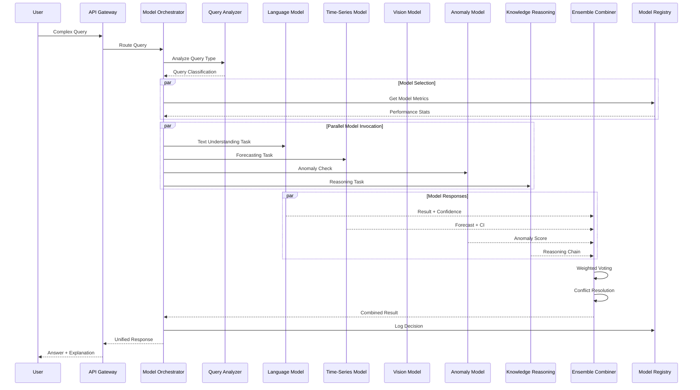
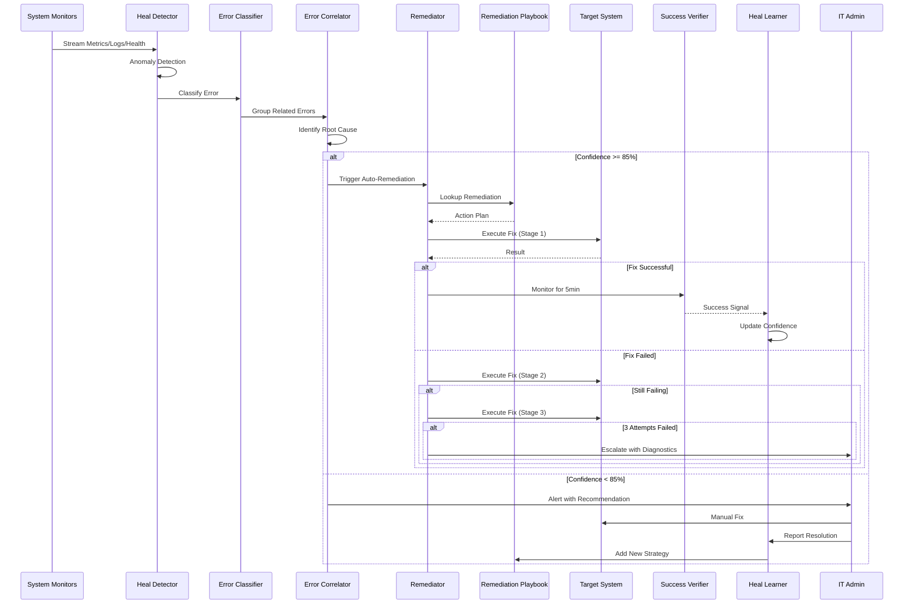
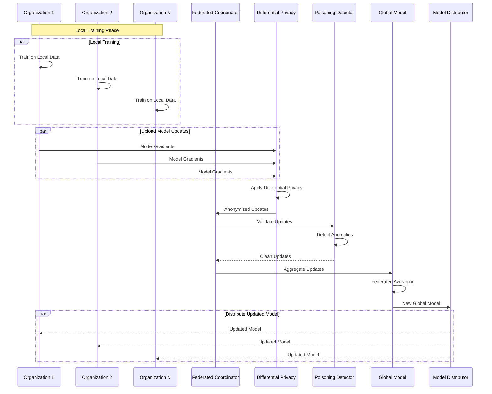
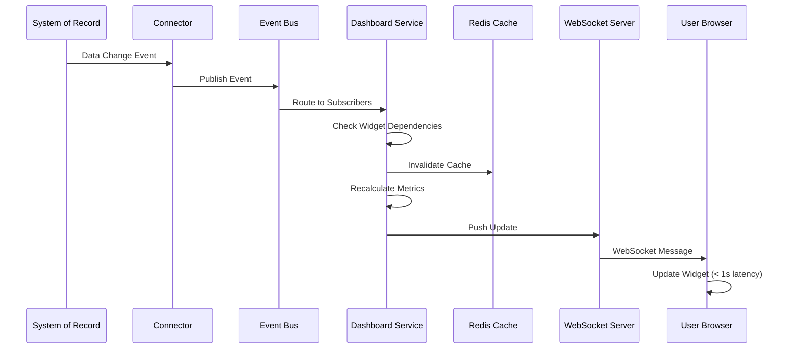

# Ellines EIP 2.0 — Technical Design Document

## Overview

Ellines EIP 2.0 represents a transformative evolution from the v1.0 foundation into an advanced, autonomous enterprise intelligence platform. Building upon the solid architecture established in v1.0 (Identity Core, Integration Hub, Workflow Engine, Ellinea AI), version 2.0 introduces three major capability pillars:

1. **Superior AI Capabilities**: Multi-model orchestration, advanced enterprise reasoning, federated learning, knowledge graph construction, collaborative intelligence, and enhanced natural language query
2. **Autonomous Self-Healing System**: Automatic error detection, autonomous remediation, learning evolution, intelligent alert correlation, and advanced security anomaly detection
3. **Futuristic Dashboards**: Role-specific next-generation visualization interfaces with real-time updates, predictive analytics, advanced widgets, and AI copilot assistance

### Design Philosophy

EIP 2.0 maintains the core principle that **EIP sits above existing Systems of Record** — it does not replace them but instead creates an intelligence layer that observes, analyzes, orchestrates, and automates. The v2.0 enhancements focus on making this intelligence layer:

- **Autonomous**: Self-managing with minimal human intervention
- **Predictive**: Forward-looking rather than reactive
- **Collaborative**: Supporting team-based decision-making
- **Trustworthy**: Explainable AI with transparent reasoning
- **Scalable**: Supporting 10,000+ concurrent users across organizations
- **Universal**: Capable of executing any business operation or intelligence task
- **Resilient**: Maintaining connections and operations even when underlying systems fail
- **Generative**: Creating outputs in any required format (Excel, PDF, PowerPoint, Word, etc.)
- **Bridging**: Performing operations that connected systems cannot accomplish independently

### Integration with v1.0 Architecture

v2.0 extends the existing Ellines Enterprise Reference Architecture (EERA) by:

- **Experience Layer**: Adding futuristic dashboards, mobile-first PWA, collaborative workspaces
- **Intelligence Layer**: Enhancing Ellinea AI with multi-model orchestration, knowledge graph, federated learning
- **Business Layer**: Adding autonomous workflow agents, predictive analytics engine, self-healing system
- **Integration Layer**: Advanced connectors (15+ types), data quality management, intelligent alert correlation
- **Data Layer**: Knowledge graph store, model registry, remediation playbook, performance metrics warehouse
- **Infrastructure Layer**: Auto-scaling, distributed caching, real-time event streaming, multi-region support


## Architecture

### High-Level System Architecture

```mermaid
graph TB
    subgraph "Experience Layer"
        WEB[Futuristic Web Dashboard]
        MOB[Mobile PWA]
        COLLAB[Collaborative Workspace]
        API_GW[API Gateway]
    end
    
    subgraph "Intelligence Layer - Ellinea AI 2.0"
        ORCHESTRATOR[Model Orchestrator]
        KG[Knowledge Graph]
        REASON[Advanced Reasoning Engine]
        FED[Federated Learning Coordinator]
        NLU[Enhanced NLU/NLQ]
        COPILOT[AI Copilot]
    end
    
    subgraph "Autonomous Systems Layer"
        AGENT_FW[Autonomous Agent Framework]
        HEAL_DETECT[Self-Healing Detector]
        HEAL_REMED[Self-Healing Remediator]
        HEAL_LEARN[Self-Healing Learner]
        PREDICT[Predictive Analytics Engine]
        ANOMALY[Anomaly Detection Engine]
        ALERT_CORR[Alert Correlation Engine]
    end
    
    subgraph "Business Services Layer"
        DASH_SVC[Dashboard Service]
        WIDGET[Widget Renderer]
        WF_ENG[Workflow Engine v2]
        DATA_QUAL[Data Quality Service]
        PERSONA[Personalization Service]
    end
    
    subgraph "Integration Layer"
        CONN_HUB[Connector Hub v2]
        EVENT_BUS[Real-Time Event Bus]
        SYNC_ENG[Sync Engine]
        MAPPER[Intelligent Data Mapper]
    end
    
    subgraph "Data Layer"
        OP_DB[(Operational DB - PostgreSQL)]
        KG_DB[(Knowledge Graph - Neo4j)]
        TS_DB[(Time-Series DB - InfluxDB)]
        CACHE[(Distributed Cache - Redis)]
        MODEL_REG[(Model Registry)]
        REMEDIATION_DB[(Remediation Playbook)]
    end
    
    subgraph "Systems of Record"
        ERP[ERP Systems]
        CRM[CRM Systems]
        HRMS[HRMS]
        OTHER[Other Enterprise Systems]
    end
    
    WEB --> API_GW
    MOB --> API_GW
    COLLAB --> API_GW
    API_GW --> ORCHESTRATOR
    API_GW --> DASH_SVC
    API_GW --> AGENT_FW
    
    ORCHESTRATOR --> KG
    ORCHESTRATOR --> REASON
    ORCHESTRATOR --> FED
    ORCHESTRATOR --> NLU
    ORCHESTRATOR --> COPILOT
    
    AGENT_FW --> WF_ENG
    HEAL_DETECT --> HEAL_REMED
    HEAL_REMED --> HEAL_LEARN
    PREDICT --> DASH_SVC
    ANOMALY --> ALERT_CORR
    
    DASH_SVC --> WIDGET
    WIDGET --> PERSONA
    WF_ENG --> AGENT_FW
    DATA_QUAL --> CONN_HUB
    
    CONN_HUB --> EVENT_BUS
    EVENT_BUS --> SYNC_ENG
    SYNC_ENG --> MAPPER
    
    ORCHESTRATOR --> OP_DB
    KG --> KG_DB
    HEAL_DETECT --> TS_DB
    PREDICT --> TS_DB
    ORCHESTRATOR --> CACHE
    ORCHESTRATOR --> MODEL_REG
    HEAL_REMED --> REMEDIATION_DB
    
    CONN_HUB --> ERP
    CONN_HUB --> CRM
    CONN_HUB --> HRMS
    CONN_HUB --> OTHER
```




### Component Interactions

#### 1. Multi-Model AI Orchestration Flow




#### 2. Self-Healing System Flow




#### 3. Federated Learning Flow




#### 4. Real-Time Dashboard Update Flow



## Components and Interfaces

### 1. Ellinea AI 2.0 — Intelligence Layer

#### 1.1 Model Orchestrator

**Purpose**: Coordinates multiple specialized AI models, routes queries, combines outputs, and maintains model performance registry.

**Key Responsibilities**:
- Query classification and routing
- Model selection based on performance metrics
- Ensemble prediction combining
- Fallback handling
- Audit logging

**Interfaces**:
```typescript
interface ModelOrchestrator {
  // Route query to appropriate models
  routeQuery(query: Query): Promise<ModelRouting>;
  
  // Execute query across selected models
  executeQuery(routing: ModelRouting): Promise<ModelResults>;
  
  // Combine model outputs using ensemble techniques
  combineResults(results: ModelResults): Promise<UnifiedResult>;
  
  // Log model selection decision
  logDecision(decision: ModelDecision): Promise<void>;
  
  // Get model performance metrics
  getModelMetrics(modelId: string): Promise<ModelMetrics>;
}

interface Query {
  id: string;
  content: string;
  type?: QueryType;
  context: QueryContext;
  requiredCapabilities: ModelCapability[];
}

interface ModelRouting {
  primaryModel: ModelReference;
  secondaryModels: ModelReference[];
  fallbackModel: ModelReference;
  ensembleStrategy: 'weighted_vote' | 'meta_learning' | 'cascade';
}

interface ModelResults {
  results: Map<string, ModelOutput>;
  latencies: Map<string, number>;
  confidences: Map<string, number>;
}

interface UnifiedResult {
  answer: string;
  confidence: number;
  explanation: Explanation;
  sources: Source[];
  modelDecisions: ModelDecision[];
}
```


#### 1.2 Knowledge Graph Engine

**Purpose**: Constructs and maintains enterprise knowledge graph from all System of Record sources.

**Key Responsibilities**:
- Entity extraction and identification
- Relationship discovery
- Entity resolution and deduplication
- Real-time updates
- Graph query interface

**Interfaces**:
```typescript
interface KnowledgeGraphEngine {
  // Extract entities from data source
  extractEntities(source: DataSource): Promise<Entity[]>;
  
  // Identify relationships between entities
  discoverRelationships(entities: Entity[]): Promise<Relationship[]>;
  
  // Resolve duplicate entities
  resolveEntities(entities: Entity[]): Promise<ResolvedEntity[]>;
  
  // Query knowledge graph
  queryGraph(query: GraphQuery): Promise<GraphResult>;
  
  // Visualize subgraph
  visualizeSubgraph(center: Entity, depth: number): Promise<GraphVisualization>;
  
  // Update graph with new data
  updateGraph(updates: GraphUpdate[]): Promise<void>;
}

interface Entity {
  id: string;
  type: EntityType; // 'person' | 'product' | 'location' | 'event' | 'document'
  attributes: Map<string, any>;
  sourceSystem: string;
  confidence: number;
  lastUpdated: Date;
}

interface Relationship {
  id: string;
  from: EntityReference;
  to: EntityReference;
  type: RelationType;
  properties: Map<string, any>;
  confidence: number;
  evidence: Evidence[];
}

interface GraphQuery {
  startNode: EntityReference;
  traversalPattern: TraversalPattern;
  filters: QueryFilter[];
  maxDepth: number;
}
```


#### 1.3 Advanced Reasoning Engine

**Purpose**: Performs multi-hop reasoning, causal analysis, pattern detection, and hypothesis generation.

**Key Responsibilities**:
- Multi-hop graph traversal
- Causal relationship identification
- Cross-system pattern detection
- Hypothesis generation and testing
- Evidence chain construction

**Interfaces**:
```typescript
interface ReasoningEngine {
  // Perform multi-hop reasoning
  multiHopReasoning(question: Question, maxHops: number): Promise<ReasoningResult>;
  
  // Identify causal relationships
  identifyCausalLinks(events: Event[]): Promise<CausalChain[]>;
  
  // Detect patterns across systems
  detectPatterns(dataSources: DataSource[]): Promise<Pattern[]>;
  
  // Generate and test hypotheses
  generateHypotheses(observation: Observation): Promise<Hypothesis[]>;
  
  // Construct evidence chain
  buildEvidenceChain(conclusion: Conclusion): Promise<EvidenceChain>;
}

interface ReasoningResult {
  conclusion: string;
  confidence: number;
  reasoningSteps: ReasoningStep[];
  evidenceChain: EvidenceChain;
  knowledgeGaps: KnowledgeGap[];
}

interface ReasoningStep {
  stepNumber: number;
  operation: 'traverse' | 'infer' | 'aggregate' | 'compare';
  input: any;
  output: any;
  justification: string;
}

interface CausalChain {
  cause: Event;
  effect: Event;
  mechanism: string;
  confidence: number;
  temporalEvidence: TemporalAnalysis;
}
```


#### 1.4 Federated Learning Coordinator

**Purpose**: Implements privacy-preserving federated learning across organizations.

**Key Responsibilities**:
- Coordinate distributed training
- Apply differential privacy
- Detect poisoned updates
- Aggregate model improvements
- Generate transparency reports

**Interfaces**:
```typescript
interface FederatedLearningCoordinator {
  // Start federated training round
  startTrainingRound(config: FederatedConfig): Promise<TrainingRound>;
  
  // Collect model updates from organizations
  collectUpdates(roundId: string): Promise<ModelUpdate[]>;
  
  // Apply differential privacy to updates
  applyPrivacy(updates: ModelUpdate[]): Promise<PrivateUpdate[]>;
  
  // Detect poisoned updates
  detectPoisoning(updates: PrivateUpdate[]): Promise<ValidationResult>;
  
  // Aggregate clean updates
  aggregateUpdates(updates: PrivateUpdate[]): Promise<GlobalModel>;
  
  // Distribute global model
  distributeModel(model: GlobalModel): Promise<DistributionResult>;
  
  // Generate transparency report
  generateReport(roundId: string): Promise<TransparencyReport>;
}

interface FederatedConfig {
  participatingOrgs: string[];
  modelType: string;
  privacyBudget: number;
  roundDuration: number;
  aggregationStrategy: 'fedavg' | 'fedprox' | 'scaffold';
}

interface ModelUpdate {
  orgId: string;
  gradients: number[][];
  datasetSize: number;
  timestamp: Date;
}

interface PrivateUpdate {
  anonymizedId: string;
  noisyGradients: number[][];
  privacyGuarantee: PrivacyGuarantee;
}

interface TransparencyReport {
  roundId: string;
  participantCount: number;
  patternsLearned: string[];
  localVsFederal: ComparisonMetrics;
  privacyBudgetUsed: number;
}
```


### 2. Autonomous Self-Healing System

#### 2.1 Self-Healing Detector

**Purpose**: Monitors all platform components for errors, anomalies, and performance degradation.

**Key Responsibilities**:
- Multi-source monitoring (logs, metrics, health checks)
- Error pattern detection
- Severity classification
- Root cause vs symptom identification
- Incident record creation

**Interfaces**:
```typescript
interface SelfHealingDetector {
  // Monitor platform components
  monitorComponent(component: ComponentIdentifier): Observable<HealthStatus>;
  
  // Detect error patterns
  detectErrorPattern(logs: LogEntry[]): Promise<ErrorPattern[]>;
  
  // Classify error severity
  classifyError(error: Error): ErrorClassification;
  
  // Correlate related errors
  correlateErrors(errors: Error[]): Promise<ErrorCluster[]>;
  
  // Create incident record
  createIncident(cluster: ErrorCluster): Promise<Incident>;
}

interface HealthStatus {
  component: string;
  status: 'healthy' | 'degraded' | 'failing' | 'down';
  metrics: HealthMetrics;
  timestamp: Date;
}

interface ErrorClassification {
  severity: 'critical' | 'high' | 'medium' | 'low';
  impact: ImpactScope;
  category: ErrorCategory;
  isRootCause: boolean;
}

interface ErrorCluster {
  id: string;
  rootCause: Error;
  symptoms: Error[];
  affectedComponents: string[];
  firstOccurrence: Date;
  frequency: number;
}

interface Incident {
  id: string;
  errorCluster: ErrorCluster;
  diagnostics: DiagnosticData;
  recommendedActions: RemediationAction[];
  confidence: number;
}
```


#### 2.2 Self-Healing Remediator

**Purpose**: Executes automated remediation actions based on playbook and policy.

**Key Responsibilities**:
- Lookup remediation strategies
- Execute multi-stage fixes
- Verify remediation success
- Escalate failures
- Audit all actions

**Interfaces**:
```typescript
interface SelfHealingRemediator {
  // Execute remediation for incident
  remediate(incident: Incident): Promise<RemediationResult>;
  
  // Lookup remediation strategy
  lookupStrategy(error: ErrorPattern): Promise<RemediationStrategy>;
  
  // Execute specific action
  executeAction(action: RemediationAction, stage: number): Promise<ActionResult>;
  
  // Verify remediation success
  verifySuccess(incident: Incident, duration: number): Promise<VerificationResult>;
  
  // Escalate to human
  escalate(incident: Incident, attempts: RemediationAttempt[]): Promise<void>;
}

interface RemediationStrategy {
  errorPattern: string;
  stages: RemediationStage[];
  confidenceThreshold: number;
  maxAttempts: number;
  verificationPeriod: number;
}

interface RemediationStage {
  stageNumber: number;
  actions: RemediationAction[];
  preconditions: Condition[];
  timeout: number;
}

interface RemediationAction {
  type: 'restart' | 'cache_clear' | 'pool_reset' | 'rate_limit' | 'rollback' | 'scale_up';
  target: string;
  parameters: Map<string, any>;
  riskLevel: 'low' | 'medium' | 'high';
}

interface RemediationResult {
  success: boolean;
  stagesExecuted: number;
  actionsPerformed: RemediationAction[];
  timeTaken: number;
  beforeSnapshot: SystemSnapshot;
  afterSnapshot: SystemSnapshot;
}
```


#### 2.3 Self-Healing Learner

**Purpose**: Learns from remediation outcomes to improve future healing capabilities.

**Key Responsibilities**:
- Record remediation outcomes
- Identify successful patterns
- Learn from manual fixes
- Adjust confidence thresholds
- Recommend architecture improvements

**Interfaces**:
```typescript
interface SelfHealingLearner {
  // Record remediation outcome
  recordOutcome(result: RemediationResult): Promise<void>;
  
  // Analyze successful remediations
  analyzeSuccesses(timeWindow: TimeRange): Promise<Pattern[]>;
  
  // Learn from manual fix
  learnFromManualFix(incident: Incident, fix: ManualFix): Promise<NewStrategy>;
  
  // Adjust confidence thresholds
  adjustThresholds(strategy: string): Promise<UpdatedStrategy>;
  
  // Recommend architecture improvements
  recommendImprovements(): Promise<Recommendation[]>;
  
  // Share learned strategies via federated learning
  shareStrategies(): Promise<FederatedContribution>;
}

interface ManualFix {
  incidentId: string;
  adminId: string;
  actions: Action[];
  resolution: string;
  timeTaken: number;
}

interface NewStrategy {
  errorPattern: string;
  learnedActions: RemediationAction[];
  confidence: number;
  requiresApproval: boolean;
}

interface Recommendation {
  type: 'architecture' | 'configuration' | 'monitoring';
  description: string;
  rationale: string;
  preventedErrorTypes: string[];
  estimatedImpact: ImpactEstimate;
}
```


### 3. Predictive Analytics Engine

**Purpose**: Forecasts future trends, risks, and opportunities using ensemble methods.

**Key Responsibilities**:
- Time-series forecasting
- Leading indicator identification
- Early warning signals
- Scenario analysis
- Forecast accuracy tracking

**Interfaces**:
```typescript
interface PredictiveAnalyticsEngine {
  // Generate forecast
  forecast(metric: Metric, horizon: number): Promise<Forecast>;
  
  // Identify leading indicators
  identifyLeadingIndicators(targetMetric: Metric): Promise<Indicator[]>;
  
  // Detect early warning signals
  detectWarnings(domain: AnalyticsDomain): Promise<Warning[]>;
  
  // Generate scenarios
  generateScenarios(context: ScenarioContext): Promise<Scenario[]>;
  
  // Track forecast accuracy
  trackAccuracy(forecastId: string): Promise<AccuracyMetrics>;
  
  // Retrain model
  retrainModel(modelId: string): Promise<ModelVersion>;
}

interface Forecast {
  metric: string;
  timeHorizon: number;
  predictions: ForecastPoint[];
  confidenceIntervals: ConfidenceInterval[];
  modelUsed: string;
  explainability: ForecastExplanation;
}

interface ForecastPoint {
  timestamp: Date;
  value: number;
  confidence: number;
}

interface Warning {
  type: 'operational_risk' | 'financial_issue' | 'resource_constraint';
  description: string;
  probability: number;
  timeframe: string;
  indicators: Indicator[];
  recommendations: string[];
}

interface Scenario {
  name: string;
  type: 'best_case' | 'worst_case' | 'most_likely';
  assumptions: Assumption[];
  outcomes: OutcomeProjection[];
  probability: number;
}
```


### 4. Alert Correlation Engine

**Purpose**: Groups related alerts, identifies root causes, and reduces alert noise.

**Key Responsibilities**:
- Alert clustering
- Root cause identification
- Duplicate suppression
- Alert storm detection
- Topology visualization

**Interfaces**:
```typescript
interface AlertCorrelationEngine {
  // Correlate alerts
  correlateAlerts(alerts: Alert[]): Promise<AlertCluster[]>;
  
  // Identify root cause
  identifyRootCause(cluster: AlertCluster): Promise<RootCauseAnalysis>;
  
  // Suppress duplicates
  suppressDuplicates(alerts: Alert[]): Promise<Alert[]>;
  
  // Detect alert storm
  detectStorm(alerts: Alert[], timeWindow: number): Promise<AlertStorm | null>;
  
  // Visualize topology
  visualizeTopology(cluster: AlertCluster): Promise<TopologyVisualization>;
  
  // Calculate urgency
  calculateUrgency(alert: Alert): Promise<UrgencyScore>;
}

interface AlertCluster {
  id: string;
  alerts: Alert[];
  rootCause: Alert | null;
  symptoms: Alert[];
  correlationStrength: number;
  firstSeen: Date;
  lastSeen: Date;
}

interface RootCauseAnalysis {
  rootCause: Alert;
  causationChain: CausationLink[];
  confidence: number;
  affectedSystems: string[];
  estimatedImpact: ImpactAssessment;
}

interface AlertStorm {
  id: string;
  alertCount: number;
  timeWindow: number;
  summary: string;
  topCategories: Map<string, number>;
  action: 'create_incident' | 'suppress' | 'escalate';
}

interface UrgencyScore {
  score: number; // 0-100
  businessImpact: number;
  affectedUsers: number;
  serviceDependencies: string[];
}
```


### 5. Futuristic Dashboard System

#### 5.1 Dashboard Service

**Purpose**: Manages dashboard configurations, widget composition, real-time updates, and rendering.

**Key Responsibilities**:
- Dashboard CRUD operations
- Widget layout management
- Real-time data streaming
- Role-based customization
- Export and sharing

**Interfaces**:
```typescript
interface DashboardService {
  // Create dashboard
  createDashboard(config: DashboardConfig): Promise<Dashboard>;
  
  // Get dashboard for user
  getDashboard(userId: string, role: Role): Promise<Dashboard>;
  
  // Update widget
  updateWidget(dashboardId: string, widget: Widget): Promise<void>;
  
  // Stream real-time updates
  streamUpdates(dashboardId: string): Observable<WidgetUpdate>;
  
  // Export dashboard
  exportDashboard(dashboardId: string, format: 'pdf' | 'png'): Promise<Buffer>;
  
  // Share dashboard
  shareDashboard(dashboardId: string, permissions: SharePermission): Promise<ShareLink>;
}

interface DashboardConfig {
  name: string;
  role: Role;
  layout: LayoutGrid;
  widgets: Widget[];
  refreshRate: number;
  theme: 'dark' | 'light' | 'high_contrast';
}

interface Widget {
  id: string;
  type: WidgetType;
  title: string;
  dataSource: DataSourceConfig;
  visualization: VisualizationConfig;
  filters: Filter[];
  refreshInterval: number;
  position: GridPosition;
  size: GridSize;
}

type WidgetType = 'kpi_card' | 'line_chart' | 'bar_chart' | 'pie_chart' | 
                  'heat_map' | 'network_graph' | 'sankey' | 'gauge' | 
                  'sparkline' | 'table' | 'map' | 'timeline' | 'radar' |
                  'waterfall' | 'funnel' | 'scatter' | 'box_plot' | 
                  'treemap' | 'ai_insight' | 'alert_list';

interface WidgetUpdate {
  widgetId: string;
  data: any;
  timestamp: Date;
  changeType: 'data' | 'config' | 'alert';
}
```


### 6. Universal Operations Engine

#### 6.1 Document Generation Service

**Purpose**: Generates professional documents in multiple formats from enterprise data.

**Key Responsibilities**:
- Multi-format document generation (Excel, PDF, Word, PowerPoint)
- Template management and branding
- Data formatting and visualization embedding
- Delivery and distribution

**Interfaces**:
```typescript
interface DocumentGenerationService {
  // Generate Excel workbook
  generateExcel(config: ExcelConfig): Promise<ExcelWorkbook>;
  
  // Generate PDF document
  generatePDF(config: PDFConfig): Promise<PDFDocument>;
  
  // Generate Word document
  generateWord(config: WordConfig): Promise<WordDocument>;
  
  // Generate PowerPoint presentation
  generatePowerPoint(config: PowerPointConfig): Promise<PowerPointPresentation>;
  
  // Apply organization branding
  applyBranding(document: Document, orgId: string): Promise<BrandedDocument>;
  
  // Deliver document
  deliverDocument(document: Document, delivery: DeliveryConfig): Promise<DeliveryResult>;
}

interface ExcelConfig {
  sheets: SheetDefinition[];
  formulas: FormulaDefinition[];
  charts: ChartDefinition[];
  pivotTables: PivotTableDefinition[];
  formatting: ExcelFormatting;
  dataSource: DataSourceQuery;
}

interface PDFConfig {
  layout: PageLayout;
  sections: Section[];
  header: HeaderConfig;
  footer: FooterConfig;
  visualizations: VisualizationEmbedding[];
  branding: BrandingConfig;
  dataSource: DataSourceQuery;
}

interface WordConfig {
  template: TemplateReference;
  sections: ContentSection[];
  tables: TableDefinition[];
  images: ImageEmbedding[];
  styles: StyleDefinition[];
  dataSource: DataSourceQuery;
}

interface PowerPointConfig {
  template: TemplateReference;
  slides: SlideDefinition[];
  masterSlide: MasterSlideConfig;
  animations: AnimationConfig[];
  speakerNotes: SpeakerNoteConfig[];
  dataSource: DataSourceQuery;
}

interface DeliveryConfig {
  method: 'email' | 'download' | 'webhook' | 'dms_integration';
  recipients?: string[];
  subject?: string;
  message?: string;
  expiryDuration?: number;
}
```

#### 6.2 Resilient Connection Manager

**Purpose**: Establishes and maintains connections with business systems using multiple connection methods with automatic failover.

**Key Responsibilities**:
- Connection method discovery and selection
- Automatic code generation for unsupported systems
- Connection redundancy and failover
- Alternative connection path establishment
- Connection health monitoring

**Interfaces**:
```typescript
interface ResilientConnectionManager {
  // Establish resilient connection
  establishConnection(system: SystemIdentifier): Promise<ResilientConnection>;
  
  // Generate connector code
  generateConnectorCode(system: SystemIdentifier): Promise<GeneratedConnector>;
  
  // Attempt alternative connection
  attemptAlternative(connection: ResilientConnection): Promise<ConnectionResult>;
  
  // Monitor connection health
  monitorHealth(connection: ResilientConnection): Observable<ConnectionHealth>;
  
  // Failover to backup method
  failover(connection: ResilientConnection): Promise<FailoverResult>;
}

interface ResilientConnection {
  id: string;
  systemId: string;
  primaryMethod: ConnectionMethod;
  backupMethods: ConnectionMethod[];
  currentMethod: ConnectionMethod;
  healthStatus: ConnectionHealth;
  lastSuccessfulConnection: Date;
}

interface ConnectionMethod {
  type: 'api' | 'database' | 'file_sync' | 'screen_scrape' | 'message_queue' | 'webhook';
  config: ConnectionConfig;
  priority: number;
  successRate: number;
  avgLatency: number;
}

interface GeneratedConnector {
  systemId: string;
  sourceCode: string;
  language: 'typescript' | 'python' | 'java';
  dependencies: string[];
  testCases: TestCase[];
  requiresApproval: boolean;
}

interface ConnectionResult {
  success: boolean;
  method: ConnectionMethod;
  latency: number;
  dataQuality: number;
  errorMessage?: string;
}
```

#### 6.3 Email Intelligence Service

**Purpose**: Connects to, analyzes, and manages business email accounts with AI-powered processing.

**Key Responsibilities**:
- Email account connection and authentication
- Email summarization and categorization
- Actionable item extraction
- Draft response generation
- Thread tracking and context management

**Interfaces**:
```typescript
interface EmailIntelligenceService {
  // Connect email account
  connectAccount(credentials: EmailCredentials): Promise<EmailAccount>;
  
  // Summarize unread emails
  summarizeUnread(accountId: string, filters?: EmailFilter): Promise<EmailSummary>;
  
  // Categorize emails
  categorizeEmails(emails: Email[]): Promise<CategorizedEmails>;
  
  // Extract actionable items
  extractActions(email: Email): Promise<ActionItem[]>;
  
  // Draft response
  draftResponse(email: Email, context: ResponseContext): Promise<DraftEmail>;
  
  // Track email thread
  trackThread(threadId: string): Promise<ThreadSummary>;
}

interface EmailCredentials {
  provider: 'gmail' | 'outlook' | 'exchange';
  authMethod: 'oauth' | 'app_password';
  credentials: AuthCredentials;
}

interface EmailSummary {
  totalUnread: number;
  urgent: EmailPreview[];
  actionRequired: EmailPreview[];
  information: EmailPreview[];
  lowPriority: EmailPreview[];
  narrative: string;
}

interface CategorizedEmails {
  customerInquiry: Email[];
  vendorCommunication: Email[];
  internalUpdate: Email[];
  spam: Email[];
  newsletter: Email[];
  other: Email[];
}

interface ActionItem {
  type: 'task' | 'approval' | 'meeting_request' | 'information_request';
  description: string;
  dueDate?: Date;
  assignee?: string;
  priority: 'high' | 'medium' | 'low';
  relatedEntities: EntityReference[];
}

interface ThreadSummary {
  threadId: string;
  participants: string[];
  subject: string;
  messageCount: number;
  keyPoints: string[];
  decisionsMade: Decision[];
  pendingActions: ActionItem[];
}
```

#### 6.4 Fleet Tracking Service

**Purpose**: Integrates with GPS systems to track and analyze company vehicles, equipment, and mobile assets.

**Key Responsibilities**:
- Real-time asset location tracking
- Route history and playback
- Geofence management
- Utilization analytics
- Maintenance tracking

**Interfaces**:
```typescript
interface FleetTrackingService {
  // Get real-time asset locations
  getRealTimeLocations(filters?: AssetFilter): Promise<AssetLocation[]>;
  
  // Get route history
  getRouteHistory(assetId: string, timeRange: TimeRange): Promise<RouteHistory>;
  
  // Create geofence
  createGeofence(definition: GeofenceDefinition): Promise<Geofence>;
  
  // Monitor geofence violations
  monitorGeofences(): Observable<GeofenceViolation>;
  
  // Calculate utilization metrics
  calculateUtilization(assetId: string, period: TimePeriod): Promise<UtilizationMetrics>;
  
  // Get maintenance schedule
  getMaintenanceSchedule(assetId: string): Promise<MaintenanceSchedule>;
  
  // Recommend deployment optimization
  recommendOptimization(context: OptimizationContext): Promise<DeploymentRecommendation[]>;
}

interface AssetLocation {
  assetId: string;
  assetName: string;
  assetType: string;
  coordinates: Coordinates;
  heading: number;
  speed: number;
  status: 'moving' | 'idle' | 'stopped';
  timestamp: Date;
  address: string;
}

interface RouteHistory {
  assetId: string;
  timeRange: TimeRange;
  waypoints: Waypoint[];
  totalDistance: number;
  movingTime: number;
  idleTime: number;
  stops: Stop[];
}

interface GeofenceDefinition {
  name: string;
  type: 'circle' | 'polygon';
  coordinates: Coordinates[];
  radius?: number;
  alertOnEnter: boolean;
  alertOnExit: boolean;
  allowedAssets?: string[];
}

interface GeofenceViolation {
  assetId: string;
  geofenceId: string;
  violationType: 'unauthorized_entry' | 'unauthorized_exit';
  timestamp: Date;
  location: Coordinates;
}

interface UtilizationMetrics {
  assetId: string;
  period: TimePeriod;
  distanceTraveled: number;
  utilizationRate: number; // 0-100%
  idlePercentage: number;
  maintenanceDue: boolean;
  fuelConsumption: number;
  costPerKm: number;
}
```

#### 6.5 Cross-System Search Engine

**Purpose**: Provides unified intelligent search across all connected Systems of Record.

**Key Responsibilities**:
- Simultaneous multi-system querying
- Intent understanding and query expansion
- Result relevance ranking
- Faceted filtering
- Search personalization

**Interfaces**:
```typescript
interface CrossSystemSearchEngine {
  // Execute unified search
  search(query: SearchQuery): Promise<SearchResults>;
  
  // Get search suggestions
  getSuggestions(partialQuery: string, context: UserContext): Promise<SearchSuggestion[]>;
  
  // Refine search results
  refineResults(searchId: string, refinements: SearchRefinement): Promise<SearchResults>;
  
  // Get related entities
  getRelated(entity: Entity): Promise<RelatedEntity[]>;
  
  // Track search analytics
  trackSearchAnalytics(searchId: string, interaction: SearchInteraction): Promise<void>;
}

interface SearchQuery {
  query: string;
  filters?: SearchFilter[];
  systems?: string[];
  entityTypes?: string[];
  dateRange?: TimeRange;
  maxResults?: number;
  userContext: UserContext;
}

interface SearchResults {
  searchId: string;
  query: string;
  totalResults: number;
  results: SearchResult[];
  facets: SearchFacet[];
  relatedSearches: string[];
  executionTime: number;
}

interface SearchResult {
  id: string;
  sourceSystem: string;
  entityType: string;
  title: string;
  snippet: string;
  highlightedTerms: HighlightedText[];
  relevanceScore: number;
  metadata: ResultMetadata;
  quickActions: QuickAction[];
}

interface SearchSuggestion {
  suggestion: string;
  type: 'recent' | 'popular' | 'predicted';
  resultCount: number;
}

interface SearchRefinement {
  additionalFilters?: SearchFilter[];
  excludeFilters?: SearchFilter[];
  sortBy?: 'relevance' | 'date' | 'title';
  sortOrder?: 'asc' | 'desc';
}
```

#### 6.6 Capability Bridge Service

**Purpose**: Identifies and fills capability gaps in connected systems by providing enhanced functionality.

**Key Responsibilities**:
- Capability gap detection
- Cross-system data aggregation
- Advanced analytics provision
- Workflow automation bridging
- Format transformation

**Interfaces**:
```typescript
interface CapabilityBridgeService {
  // Detect capability gaps
  detectGaps(systems: SystemIdentifier[]): Promise<CapabilityGap[]>;
  
  // Provide bridging capability
  provideBridge(gap: CapabilityGap): Promise<BridgeImplementation>;
  
  // Aggregate cross-system data
  aggregateData(sources: DataSource[], aggregation: AggregationSpec): Promise<AggregatedData>;
  
  // Perform advanced analytics
  performAnalytics(data: DataSet, analytics: AnalyticsSpec): Promise<AnalyticsResult>;
  
  // Automate cross-system workflow
  automateWorkflow(workflow: WorkflowDefinition): Promise<AutomatedWorkflow>;
  
  // Transform data formats
  transformFormats(data: any, fromFormat: DataFormat, toFormat: DataFormat): Promise<TransformedData>;
}

interface CapabilityGap {
  id: string;
  affectedSystems: string[];
  gapType: 'missing_feature' | 'incompatible_formats' | 'no_integration' | 'limited_analytics';
  description: string;
  userRequests: number;
  businessImpact: 'high' | 'medium' | 'low';
  bridgeSolution: BridgeSolution;
}

interface BridgeImplementation {
  gapId: string;
  solution: BridgeSolution;
  implementation: string;
  performance: PerformanceMetrics;
  limitations: string[];
}

interface AggregatedData {
  sources: string[];
  records: number;
  aggregations: Map<string, AggregationResult>;
  consolidatedSchema: Schema;
  conflicts: DataConflict[];
}

interface AnalyticsSpec {
  type: 'statistical' | 'ml_inference' | 'optimization' | 'forecasting';
  algorithm: string;
  parameters: Map<string, any>;
  outputFormat: string;
}

interface WorkflowDefinition {
  name: string;
  trigger: WorkflowTrigger;
  steps: WorkflowStep[];
  systems: string[];
  approvalRequired: boolean;
}
```

## Data Models

### Core Business Entities

```typescript
// Organization entity
interface Organization {
  id: string;
  name: string;
  slug: string;
  industry: string;
  size: 'small' | 'medium' | 'large' | 'enterprise';
  settings: OrganizationSettings;
  connectedSystems: SystemConnection[];
  enterpriseDNA: EnterpriseDNA;
  subscription: SubscriptionTier;
}

// System of Record connection
interface SystemConnection {
  id: string;
  orgId: string;
  systemType: string;
  connectionMethod: ConnectionMethod;
  healthStatus: 'healthy' | 'degraded' | 'failing';
  lastSync: Date;
  syncFrequency: number;
  dataQuality: number;
}

// Enterprise DNA - learned organizational patterns
interface EnterpriseDNA {
  orgId: string;
  policies: Policy[];
  decisionPatterns: DecisionPattern[];
  workflowPreferences: WorkflowPreference[];
  communicationStyle: CommunicationStyle;
  riskTolerance: number;
  industryBenchmarks: Benchmark[];
}

// Knowledge graph entity
interface KnowledgeGraphEntity {
  id: string;
  type: EntityType;
  attributes: Map<string, any>;
  sourceSystem: string;
  confidence: number;
  lastUpdated: Date;
  relationships: KnowledgeGraphRelationship[];
}

interface KnowledgeGraphRelationship {
  id: string;
  fromEntity: string;
  toEntity: string;
  relationType: string;
  properties: Map<string, any>;
  confidence: number;
  evidence: Evidence[];
}
```

## Error Handling

### Error Types and Strategies

```typescript
// Centralized error handling
class EIPError extends Error {
  code: ErrorCode;
  severity: 'critical' | 'high' | 'medium' | 'low';
  recoverable: boolean;
  context: ErrorContext;
  timestamp: Date;
}

enum ErrorCode {
  // Connection errors
  CONNECTION_FAILED = 'CONNECTION_FAILED',
  CONNECTION_TIMEOUT = 'CONNECTION_TIMEOUT',
  AUTH_FAILED = 'AUTH_FAILED',
  
  // Data errors
  DATA_QUALITY_ISSUE = 'DATA_QUALITY_ISSUE',
  DATA_CONFLICT = 'DATA_CONFLICT',
  SCHEMA_MISMATCH = 'SCHEMA_MISMATCH',
  
  // AI errors
  MODEL_UNAVAILABLE = 'MODEL_UNAVAILABLE',
  LOW_CONFIDENCE = 'LOW_CONFIDENCE',
  REASONING_FAILED = 'REASONING_FAILED',
  
  // System errors
  RESOURCE_EXHAUSTED = 'RESOURCE_EXHAUSTED',
  RATE_LIMIT_EXCEEDED = 'RATE_LIMIT_EXCEEDED',
  SERVICE_DEGRADED = 'SERVICE_DEGRADED',
}

interface ErrorContext {
  userId?: string;
  orgId?: string;
  systemId?: string;
  operation: string;
  additionalData: Map<string, any>;
}
```

### Error Recovery Strategies

1. **Automatic Retry with Exponential Backoff**: Transient failures (network, timeout)
2. **Circuit Breaker**: Prevents cascading failures by failing fast
3. **Fallback to Alternative**: Use backup connection method or secondary model
4. **Graceful Degradation**: Return partial results with warnings
5. **Self-Healing Trigger**: Engage autonomous remediation system
6. **Human Escalation**: Alert administrators for manual intervention

## Testing Strategy

### Test Pyramid

```
                     E2E Tests
                   (5% - Critical Paths)
                  /                    \
           Integration Tests            
         (25% - Component Interaction)  
        /                                \
  Unit Tests                              
(70% - Component Logic)                   
```

### Test Categories

1. **Unit Tests**: Individual component logic, pure functions, business rules
2. **Integration Tests**: Component interactions, API contracts, database operations
3. **E2E Tests**: Critical user journeys, multi-system workflows
4. **Performance Tests**: Load testing, stress testing, latency benchmarks
5. **Security Tests**: Authentication, authorization, data encryption, injection attacks
6. **AI Model Tests**: Accuracy, bias detection, explainability validation
7. **Self-Healing Tests**: Error detection, remediation execution, learning validation
8. **Resilience Tests**: Failover, connection redundancy, graceful degradation

### Continuous Testing

- **Test Automation**: CI/CD pipeline runs all tests on every commit
- **Test Data Management**: Realistic anonymized datasets for development/testing
- **Chaos Engineering**: Inject failures to validate resilience and self-healing
- **A/B Testing**: Compare AI model versions before production deployment
- **Monitoring as Testing**: Production observability validates system behavior

## Correctness Properties

*A property is a characteristic or behavior that should hold true across all valid executions of a system—essentially, a formal statement about what the system should do. Properties serve as the bridge between human-readable specifications and machine-verifiable correctness guarantees.*

### Property 1: Model routing consistency

*For any* query type and given performance metrics, the same query classification should always route to the same model when performance metrics remain constant.

**Validates: Requirements 1.2**

### Property 2: Ensemble result confidence

*For any* ensemble prediction combining multiple model outputs, the combined confidence score must be within the bounds of the constituent model confidence scores (between minimum and maximum individual confidence values).

**Validates: Requirements 1.3**

### Property 3: Multi-hop path validity

*For any* reasoning path traversing the knowledge graph, all relationships in the path must be valid edges in the graph with confidence scores above the minimum threshold.

**Validates: Requirements 2.2**

### Property 4: Evidence chain completeness

*For any* conclusion generated by the reasoning engine, there must exist a complete evidence chain with at least one supporting piece of evidence for each reasoning step.

**Validates: Requirements 2.6**

### Property 5: Remediation idempotency

*For any* remediation action, applying the same action twice to the same system state should have the same effect as applying it once (idempotent operations).

**Validates: Requirements 5.3**

### Property 6: Confidence threshold enforcement

*For any* incident requiring remediation, automated remediation should only execute when the confidence score is greater than or equal to 85%.

**Validates: Requirements 5.2**

### Property 7: Alert cluster consistency

*For any* alert cluster, all alerts in the cluster must have timestamps that fall within the configured time window (default 5 minutes).

**Validates: Requirements 12.1**

### Property 8: Root cause uniqueness

*For any* alert cluster identified by the correlation engine, the cluster must have exactly one root cause alert (not zero, not multiple).

**Validates: Requirements 12.2**

### Property 9: Forecast confidence bounds

*For any* forecast point generated by the predictive analytics engine, the confidence interval must be within 0-100% inclusive.

**Validates: Requirements 11.1**

### Property 10: Scenario probability sum

*For any* scenario analysis, the probabilities of the best-case, worst-case, and most-likely scenarios must sum to exactly 100%.

**Validates: Requirements 11.7**

### Property 11: Search result relevance

*For any* search results returned by the cross-system search engine, results with higher ranking positions must have relevance scores greater than or equal to results with lower ranking positions (monotonic relevance ordering).

**Validates: Requirements 33.3**

### Property 12: Facet filtering correctness

*For any* facet filter applied to search results, all returned results must match the filter criteria, and all results not matching the filter criteria must be excluded.

**Validates: Requirements 33.5**

### Property 13: Confidence threshold enforcement (agents)

*For any* decision made by an autonomous agent, the agent should only act autonomously when the decision confidence is greater than or equal to 90%.

**Validates: Requirements 14.3, 14.4**

### Property 14: Agent coordination

*For any* two autonomous agents operating concurrently, they must not execute conflicting actions on the same resource within the same time window.

**Validates: Requirements 14.6**

### Property 15: Data quality score bounds

*For any* data quality score calculated for a data source or entity type, the score must be between 0 and 100 inclusive.

**Validates: Requirements 18.2**

### Property 16: Quarantine isolation

*For any* data marked as quarantined due to quality issues, that data must never propagate to downstream systems or appear in user-facing results.

**Validates: Requirements 18.5**

